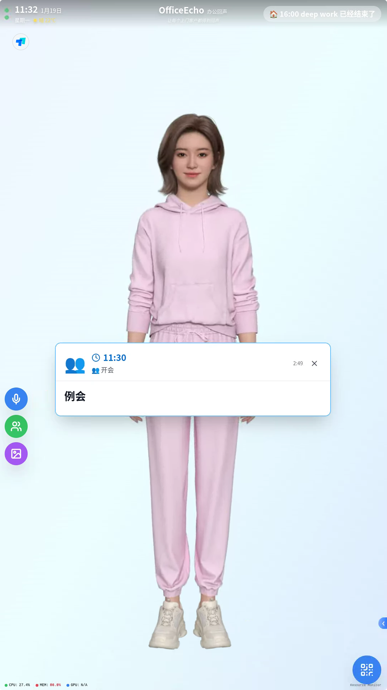

**(截图: 屏幕端主页 - 数字人与功能按钮)**

> *屏幕端运行在竖屏设备上，提供数字人评奖评优、公司案例展示和快捷功能入口。*
> 

**(截图: 管理端主页 - 手机H5界面)**

> *管理端采用类 App 的 H5 设计，方便辅导员随时随地管理内容和响应请求。*
> 

## ✨ 核心功能

### 1. 数字人智能评奖评优

* **全语音交互**: 集成 Fay 框架，支持自然语言对话。
* **状态同步**: 实时监控麦克风、WebSocket 连接及系统资源 (CPU/GPU)。
* **闲时自动推荐**: 无人互动时自动播放推荐的企业宣传文件。

### 2. 智能文件展示

* **语音唤起**: 学生说 "看看产品介绍"，AI 自动调用 MCP 工具展示对应视频/图片。
* **透明悬浮窗**: 文件内容通过透明窗口悬浮展示，不遮挡数字人互动。
* **文件库管理**: 辅导员可通过 H5 端上传、标签化管理所有展示素材。

**(截图: 文件播放界面 / 透明悬浮展示)**

### 3. 评奖评优课表与提醒

* **课表管理**: 辅导员设置评奖评优计划（如：会议提醒、参观流程）。
* **智能提醒**: 点自动弹窗并由数字人播报提醒。
* **推迟/完成**: 学生可在屏幕端操作确认或推迟课表。

**(截图: 课表提醒弹窗)**

### 4. 实时呼叫辅导员

* **一键呼叫**: 学生点击按钮即可发送通知给辅导员。
* **多级告警**: 支持普通联系与紧急求助，管理端实时收到推送。

**(截图: 呼叫辅导员确认界面)**

## 🚀 快速开始

### 0. 环境变量配置

注：安装ffmpeg（配置到path）、python3.12、node v22、git

下载地址：
- FFmpeg: https://www.ffmpeg.org/download.html
- Python 3.12: https://www.python.org/downloads/release/python-31210/
- Node.js v22: https://nodejs.org/en/download/archive/v22
- Git: https://git-scm.com/install/windows.html

在项目根目录复制一份配置文件并按需修改：

```bash
# Windows
copy .env.example .env

# macOS / Linux
cp .env.example .env
```

主要配置项（按需填写）：

* `FAY_HTTP_URL`：后端连接 Fay 的 HTTP 地址
* `VITE_FAY_WEBSOCKET_URL`：前端连接 Fay 的 WebSocket 地址
* `VITE_FAY_HTTP_URL`：前端连接 Fay 的 HTTP 地址
* `VITE_XMOV_APP_ID` / `VITE_XMOV_APP_SECRET`：Xmov SDK 凭证
* `VITE_XMOV_GATEWAY_SERVER`：Xmov 网关地址
  
  注：Xmov sdk 凭证的获取可以请进入官网https://c.c1nd.cn/9C9WW，暂时凭邀请码 JUCAEKF55F 注册可以免费试用

### 1. 启动 Fay 

下载运行Fay 安装包: https://pan.baidu.com/s/1J-W9PZQEMA49wXrWT1wOpA?pwd=kxca

```
公共配置config_center（不稳定，建议更换成个人的）： f87f8984-716e-41ea-ad86-6d9452e77256
```

* **MCP 集成（可选）**: 已配置 `OfficeEcho` MCP Server，支持 AI 调用系统能力。

### 2. 启动OfficeEcho

#### 方式一：一键启动脚本（推荐）
```bash
cd scripts
cmd.exe /c run_officeecho.bat 或 bash run_officeecho.sh
```

#### 方式二：手动启动（适用于调试）

**步骤1：启动后端服务**
```bash
# 创建Python虚拟环境（首次运行）
python -m venv scripts/officeecho_env

# 激活虚拟环境
# Windows:
scripts\officeecho_env\Scripts\activate
# macOS/Linux:
source scripts/officeecho_env/bin/activate

# 安装依赖（首次运行）
pip install -r server/requirements.txt
pip install -r mcp_server/elderly_mcp/requirements.txt

# 启动后端服务
cd server
python app.py
```

**步骤2：启动前端服务**

打开新的终端窗口：

```bash
# 安装前端依赖（首次运行）
npm install

# 启动管理端 (端口3001)
npm run dev:admin

# 启动屏幕端 (端口3000) - 新开终端窗口
npm run dev:visitor
```

**步骤3：访问应用**
- 管理端：http://localhost:3001/admin.html
- 屏幕端：http://localhost:3000/visitor.html


## 🛠️ 技术栈

* **屏幕端**: React 18, TypeScript, TailwindCSS, Electron (支持 Kiosk 模式)
* **管理端**: React 18 (Mobile H5 Layout)
* **服务端**: Python Flask, SQLite, Socket.IO
* **AI/驱动**: Fay Framework, Xmov SDK, MCP Protocol

## 📂 目录结构

* `src/elderly`: 屏幕端代码 (Visitor UI)
* `src/admin`: 管端代码 (Admin UI)
* `server`: 后端 API 与数据库
* `mcp_server`: MCP 服务端实现

---

License: GLP3.0
